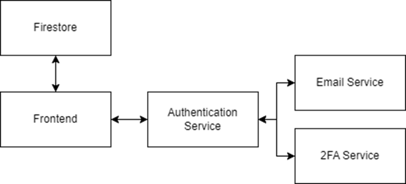

# Task Management Application

This application is designed to facilitate task management within a group, promoting better collaboration by allowing users to assign tasks to each other, set due dates, and track progress effectively.

## Table of Contents
- [Pages Overview](#pages-overview)
  - [Home](#home)
  - [Login](#login)
  - [Sign Up](#sign-up)
  - [Forgot Password](#forgot-password)
  - [Dashboard](#dashboard)
    - [My Tasks](#my-tasks)
    - [Task Status](#task-status)
    - [Create New Task](#create-new-task)
    - [Users](#users)
- [Functional Requirements](#functional-requirements)
- [Components Diagram](#components-diagram)
- [Deployment](#deployment)
- [Demonstration Video](#demonstration-video)
- [Tools Used](#tools-used)
- [Future Plans](#future-plans)

## Pages Overview

### Home
The Home page provides a brief introduction to the application, highlighting its core features and showcasing success stories from teams who have benefited from using the application.

### Login
The Login page allows existing users to log in to their accounts by entering their username and password.

### Sign Up
New users can sign up by providing their email, username, and password. They can also enable Two-Factor Authentication (2FA) to receive a QR code via email, which can be linked to an Authenticator app for enhanced security.

### Forgot Password
If a user forgets their password, they can enter their username on the Forgot Password page. A QR code for an Authenticator app will be sent to their email, allowing them to log in using a One-Time Password (OTP).

### Dashboard
The Dashboard is the main interface where users can manage their tasks. It is divided into several sections:

#### My Tasks
Users can view tasks assigned to them and filter these tasks by title and status. Tasks can also be marked as complete here.

#### Task Status
This section displays all tasks within the system, showing the task title, assignees, deadline, and status. There are three possible statuses:
1. **Completed**: The task is marked complete by the user.
2. **Incomplete**: The task is not yet marked as complete, and the deadline has not passed.
3. **Deadline Exceeded**: The deadline for the task has passed without completion.

#### Create New Task
Users can create new tasks by setting a title, deadline, and assigning it to other users in the system.

#### Users
The Users tab displays the usernames of all users registered in the system.

## Functional Requirements
- User authentication (Login, Sign Up, Forgot Password, 2FA)
- Task management (Mark tasks as complete, Delete tasks)
- Task listing (Sort tasks by status, display assignees, deadlines, and statuses)
- Task creation (Assign members, set deadlines, and titles)
- User management (Display all users in the system)
- Notifications (Send notifications when tasks are assigned)

## Components Diagram

## Deployment
The application is containerized using Docker, pushed to the Google Cloud Platform (GCP) Artifact Registry, and deployed using GCP Kubernetes Engine.

## Demonstration Video
Watch the application in action: [Demonstration Video](https://youtu.be/yDXTHxN6rc8)

## Tools Used
- Visual Studio Code
- Git
- Docker
- Kubernetes
- Kubectl
- Google Kubernetes Engine
- Google Container Registry
- Firebase
- Speakeasy
- Sendgrid

## Future Plans
- Implementing a calendar view for tasks
- Adding file upload capabilities for tasks
- Allowing users to add comments to tasks
- Implementing a CI/CD pipeline for automatic deployment on commits
